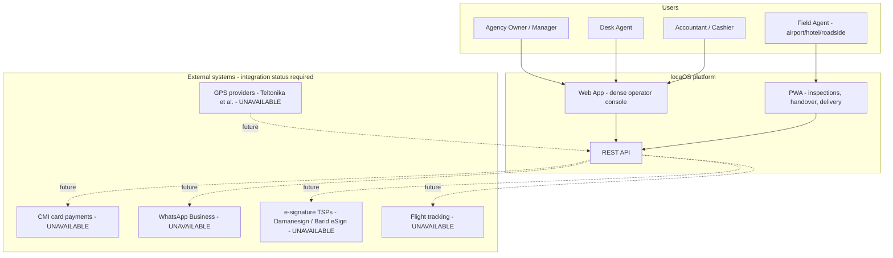

# locaOS — Proposed Architecture (Phase 0)

Status: **PROPOSED — awaiting review.** Companion documents:
[domain model](domain-model.md) · [database model](database-model.md) ·
[application structure](application-structure.md) · [tech stack](tech-stack.md) ·
[critical analysis](critical-analysis.md) · [roadmap](roadmap.md)

---

## 1. Architectural drivers

1. **Operational truth over CRUD** — the system's value is reasoning across
   fleet → reservations → contracts → money → compliance (§2).
2. **Tenant isolation enforced in the backend, twice** (app scoping + RLS) (§5).
3. **Integrity as a database guarantee** — double bookings, audit history, financial
   immutability are constraints, not conventions (§7, §10, §11).
4. **Hybrid paper/digital reality** — Morocco-first, cash-first, WhatsApp-first workflows
   are first-class, not edge cases (§8, §18).
5. **Mobile under poor connectivity** — inspections must complete offline (§17).
6. **No dangerous automation** — high-impact actions require human confirmation (§14).
7. **Extensibility without rewrites** — GPS/payments/messaging behind ports (§13, §26).

## 2. System context (C4 level 1)



Every external system is **UNAVAILABLE** until an adapter exists and is configured with real
credentials; the label is a runtime status, visible in the UI (§26).

## 3. Containers

| Container | Tech | Responsibility |
|---|---|---|
| `web` | Next.js | Operator console: dashboard/brief, fleet, reservations, contracts, finance. SSR + PWA shell. |
| `mobile` (same codebase) | PWA route group in `web` | Offline-first inspection, handover, delivery, customer verification. |
| `api` | NestJS | Domain modules, auth, validation, PDF generation trigger, REST + OpenAPI. |
| `worker` | NestJS context + pg-boss | Scheduled evaluators (overdue, snapshots), outbox dispatch, rule engine ticks, PDF renders. |
| `postgres` | PostgreSQL 16 | Single source of truth: domain data, sessions, jobs, outbox, snapshots. |
| `object-store` | S3-compatible | Photos, signatures, generated PDFs. Private buckets + signed URLs. |

One deployable unit initially (api + worker in one image, two processes) — split later behind
the same interfaces.

## 4. Module map (inside `api` / `packages/domain`)

```
iam/          agencies, branches, users, roles, sessions, audit
fleet/        vehicles, categories, models, documents, state machine
customers/    customers, identity documents, drivers, flags
reservations/ calendar, conflict detection, quotes, operational readiness
contracts/    templates, versions, amendments, numbering, blank contracts, PDF
inspections/  checklists, photos, damages, acknowledgements
finance/      payments, deposits, invoices, cash sessions, reconciliation
maintenance/  records, tasks, blocking windows
ops/          assignments, deliveries/pickups, cleaning tasks
alerts/       rule registry, evaluation, notifications, acknowledgement
telematics/   [PORT] provider adapters, normalized events, geofences
reporting/    daily snapshots, briefs, profitability
ai/           (Phase 10+) read-only reasoning, typed answers
integration/  [PORTS] payment gateway, messaging, e-signature, flight info
```

Rules enforced by lint: modules talk to each other only through exported application
services; no module reads another module's tables directly; `packages/domain` contains
pure TypeScript (state machines, pricing, policies) importable by web and mobile without
NestJS.

## 5. The event spine

All significant domain actions follow one shape:

```
Command → Module service (validation + invariant checks, in a DB transaction)
        → State committed
        → Domain events appended to OUTBOX (same transaction)
        → Worker delivers: rule engine, snapshot updater, notifications
        → Audit event written (append-only)
```

- **VehicleMoved + status AVAILABLE → CRITICAL alert** is one *rule record*, not an
  `if` in a controller (§12).
- Rules declare `actionKind ∈ {NOTIFY, CREATE_TASK, REQUIRE_APPROVAL}`. Any action touching
  money/contracts/customers/third parties is `REQUIRE_APPROVAL` → creates an approval record,
  executes nothing (§14).
- The morning-brief snapshot (§16) is a per-day/branch materialized row updated by events,
  deterministically rebuildable — it is a cache, never a source of truth.

## 6. Key runtime flows (abridged)

### 6.1 Reservation creation (conflict-checked)

1. `POST /reservations` (Zod-validated, tenant-scoped).
2. Service opens transaction; checks vehicle calendar via **exclusion constraint** attempt —
   overlap with active reservations, maintenance windows, or administrative holds → 409 with
   machine-readable conflict list (which reservation/window, at which branch).
3. Price quoted from pricing policy (versioned); deposit requirement computed.
4. Commit reservation (`DRAFT`→`CONFIRMED` on payment rules per agency config);
   `ReservationCreated` event → readiness checklist generated.

### 6.2 Departure (vehicle pipeline)

Reservation readiness window opens → vehicle `AVAILABLE→RESERVED→PREPARING` (prep tasks) →
`CONTRACT_READY` once contract signed + deposit secured → `IN_TRANSIT` (delivery) → `RENTED`
at handover against departure inspection. Every transition: guarded, transactional, appended
to `vehicle_state_transitions` + audit. Illegal transition → 422 + explanation.

### 6.3 Return + inspection (offline-capable)

Field agent completes return inspection offline (IndexedDB outbox, client UUIDs, queued
photos). Vehicle `RENTED→AWAITING_INSPECTION` at check-in. Sync applies inspection
idempotently; damages reconcile against departure inspection; new damage → linked `Damage`
records + optional alert; vehicle → `INSPECTED→CLEANING→AVAILABLE` via ops tasks. Fuel/mileage
deltas → chargeable items on the contract (amounts always human-confirmed).

### 6.4 Money in / cash session

Payment recorded (cash/card/transfer) against contract/reservation → immutable row +
ledger entry. Cash drawer opened per employee/branch (session); closed with counted
denominations → variance computed and attributed. Corrections are reversal entries, never
edits (§10, §11).

### 6.5 Blank paper contract

"Print Blank Contract" → per-agency sequence reserves number → stub `Contract
(status=BLANK_ISSUED)` + PDF with numbered header and empty designated fields. Later
reconciliation binds the paper sheet to a reservation (upgrade to full contract with the same
number) or marks it `VOIDED(reason)` — sequence gaps auditable (§8; critical-analysis §4).

### 6.6 Telematics ingestion (Phase 11+, port defined now)

Adapter (e.g., Teltonika) authenticates device → normalizes to internal events
(`VehicleMoved`, `IgnitionOff`, `GpsDisconnected`…) → idempotent ingestion (device message id)
→ rule engine with hysteresis/quiescence (critical-analysis §7). Provider quirks never enter
the domain.

## 7. Tenancy & security architecture

```
Request → cookie session → user + active agency context
        → API guard: permission check (RBAC matrix)
        → Tenant transaction wrapper: SET LOCAL app.agency_id = <uuid>
        → Repository layer (agency-scoped by construction)
        → PostgreSQL RLS policies (second wall; assert tenant columns)
```

- One user may belong to multiple agencies (multi-agency owners) — agency context is explicit
  per session, switch is an audited event.
- Cross-tenant tests are mandatory in CI: authenticated as tenant A, attempt read/write on
  tenant B resources → expect rejection at both layers.
- Photo/signature access via short-lived signed URLs scoped to object + tenant.
- Sensitive fields (identity document numbers) encrypted at rest (pgcrypto/KMS later),
  masked in UI by default with unmask-permission + audit.

## 8. Offline architecture (PWA)

- Service worker precaches shell + active-day task data; IndexedDB queues: inspection
  submissions (client UUID), photos (compressed, checksummed), signatures.
- Outbox sync is idempotent: server treats repeated client UUID as the same submission.
- Conflict policy: inspection field groups are last-write-wins **with full version history
  retained**; conflicting submissions raise an anomaly alert rather than silent overwrite.
- Contract retrieval caches the day's departure packets (contract PDF + customer record).

## 9. Deployment view

- **Dev:** Docker Compose (postgres, api, web, worker, minio).
- **Prod (target):** single EU region (Law 09-08 cross-border note — register #4; final
  hosting decision + CNDP formalities documented at deployment time, not hardcoded),
  managed Postgres with PITR backups, daily encrypted snapshot of object store.
- Environments: `dev`, `staging`, `prod`. Migrations run via CI job, forward-only; no manual
  schema changes (§22).

## 10. Trade-offs accepted (and revisit triggers)

| Decision | Cost | Revisit when |
|---|---|---|
| Modular monolith, one Postgres | Single runtime scaling ceiling | Sustained load > what one node + read replicas serve |
| PWA not native | No BLE/background GPS | Telematics-grade mobile tracking requirement appears |
| Headless-Chromium PDFs | Runtime weight | PDF volume makes render farm necessary |
| pg-boss jobs | Queue throughput tied to PG | Job latency SLOs breached at scale |
| Single enum vehicle status | Exceptional-state ambiguity (critical-analysis §2) | GPS/accident phase if state conflicts bite |
| Sessions not JWT | Session store on PG | Native mobile apps need third-party auth |
